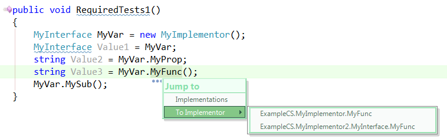
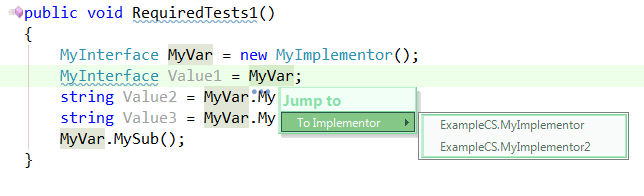

CR_InterfaceNav
===============
Provides a number of implementations of '**To Implementor**' within the CodeRush '**Jump To**' SmartTag menu

Usage
====
 * Place caret in any supported location 
 * Activate using default Navigate keystroke of Ctrl+Alt+N 
 * Choose "To Implementor"
 * Select implementation of method or class you'd like to jump to.

Supports
====

    

	// MyVar is declared as *MyInterface*

    MyInterface MyVar = new MyImplementor(); 
    MyInterface Value1 = MyVar;         // From MyVar 
    string Value2 = MyVar.MyProp;       // From MyVar or MyProp
    string Value3 = MyVar.MyFunc();     // From MyVar or MyFunc
    MyVar.MySub();                      // From MyVar or MySub

	// MyVar declared as *MyImplementor*

    MyImplementor MyVar = new MyImplementor();
    MyInterface Value1 = MyVar;         // From MyVar 
    string Value2 = MyVar.MyProp;       // From MyVar or MyProp
    string Value3 = MyVar.MyFunc();     // From MyVar or MyFunc
    MyVar.MySub();                      // From MyVar or MySub

